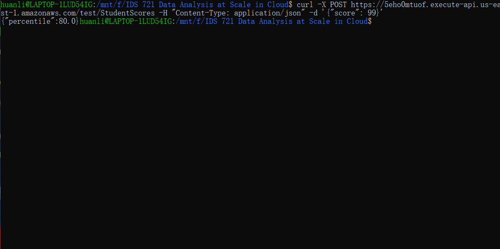
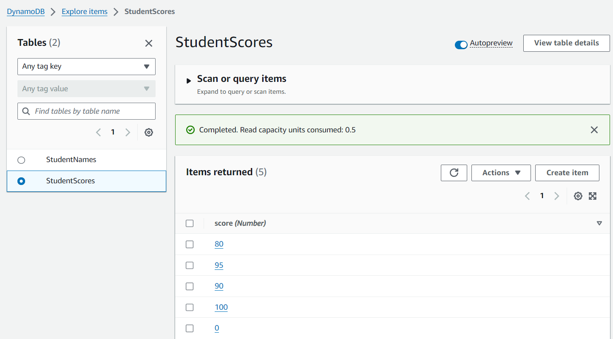
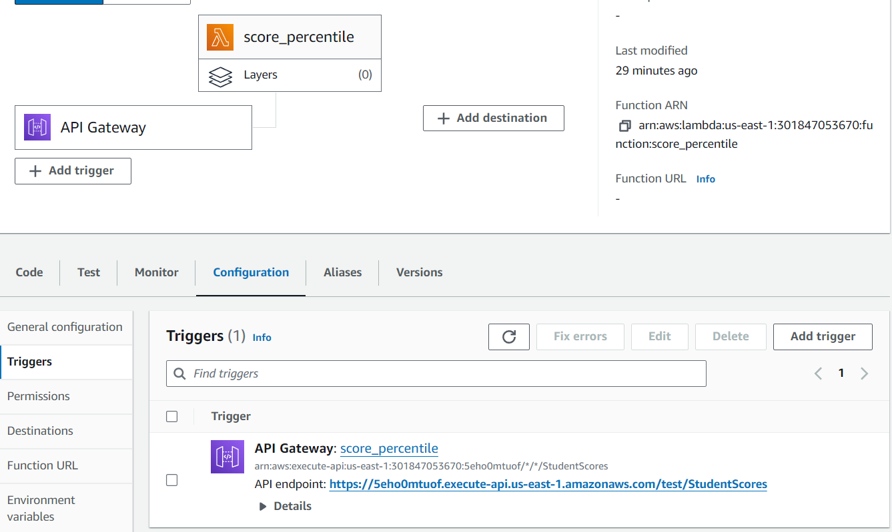

[
# Serverless Rust Microservice for Score Percentile
This project aims to develop a serverless function on AWS Lambda utilizing Rust and Cargo Lambda, integrating with a database - AWS DynamoDB. This project focuses on leveraging AWS Lambda's capabilities, integrating with AWS API Gateway, and utilizing DynamoDB. The objective is to create a Lambda function that can calculate the percentile rank of a given score among all scores.
## Goals
* Create a Rust AWS Lambda function (or app runner)
* Implement a simple service
* Connect to a database

## Steps
### Step 1: Initialize Rust Project
* Begin by initializing your Cargo Lambda project using the command `cargo lambda new <YOUR-PROJECT-NAME>`. 
* Modify the `Cargo.toml` and `src/main.rs` file according to your design and requirements.
* Navigate to the project directory, locally test the functionality by running the command `cargo lambda watch` .

### Step 2: AWS Setup
* Navigate to the AWS IAM Management Console to create a new IAM User for credential management.
* Attach policies `LambdaFullAccess` and `IAMFullAccess`.
* Under `Security Sredentials` section, generate an access key for API access. Make sure the key is safely stored and not lost.
* Set up your environment variables so that cargo lambda knows which AWS account and region to deploy to. 
```
export AWS_ACCESS_KEY_ID="your_access_key_here"
export AWS_SECRET_ACCESS_KEY="your_secret_key_here"
export AWS_DEFAULT_REGION="your_preferred_region_here"
```
* Build the project by running `cargo lambda build --release`.
* Deploy the project by running `cargo lambda deploy`.
* Go to AWS console and enter AWS Lambda, navigate into your lambda function, then under `Configuration`, click `Permission`, then click the link under your `Role name`. 
* In the new tab, attach policies `AmazonDynamoDBFullAccess` and `AWSLambdaBasicExecutionRole` to your role.

### Step 3: Connection to DynamoDB and API Configuration
* Navigate to the AWS console to establish a DynamoDB table. Click on the `Items` tab, then click on `Create item`.
* Choose a name for your table. The name must align with that in your `main.rs` file.
* Partition key: This is the primary key of your table.
* 'Explore table items' -> 'Create item' to insert the item.
* Once the table is ready, proceed to link your Lambda function with AWS API Gateway.
* Initiate a new API setup, opting for the default REST API option, and then create a new resource for your API's endpoint.
* For the created resource, implement an `ANY` method and associate it with your Lambda function.
* Launch your API by creating a new deployment stage.
* Click deploy, find `stages` and find your invoke URL.
* You can test your API gateway using `curl` request:
```
curl -X POST https://5eho0mtuof.execute-api.us-east-1.amazonaws.com/test/StudentScores -H "Content-Type: application/json" -d '{"score": 99}'
```
### Step 4: Gitlab Deploy
* After the success of test, set your `AWS_ACCESS_KEY_ID`, `AWS_SECRET_ACCESS_KEY`, and `AWS_REGION` to gitlab `Settings -> CI/CD -> Variables`.
* Use `.gitlab-ci.yml` and `makefile` to enable auto build, test, and deploy of the lambda function.

## Screenshots
* Curl request

The function successfully randomly choose one student who satisfy the input criteria.

* DynamoDB


* Lambda



